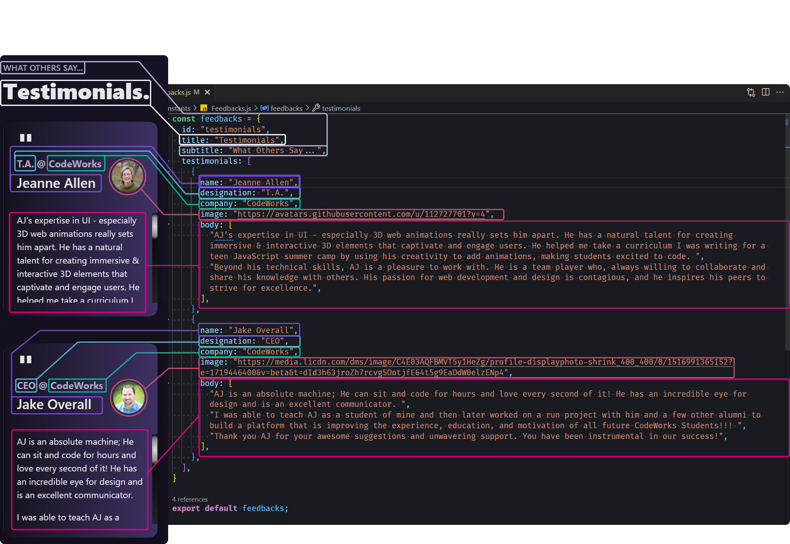
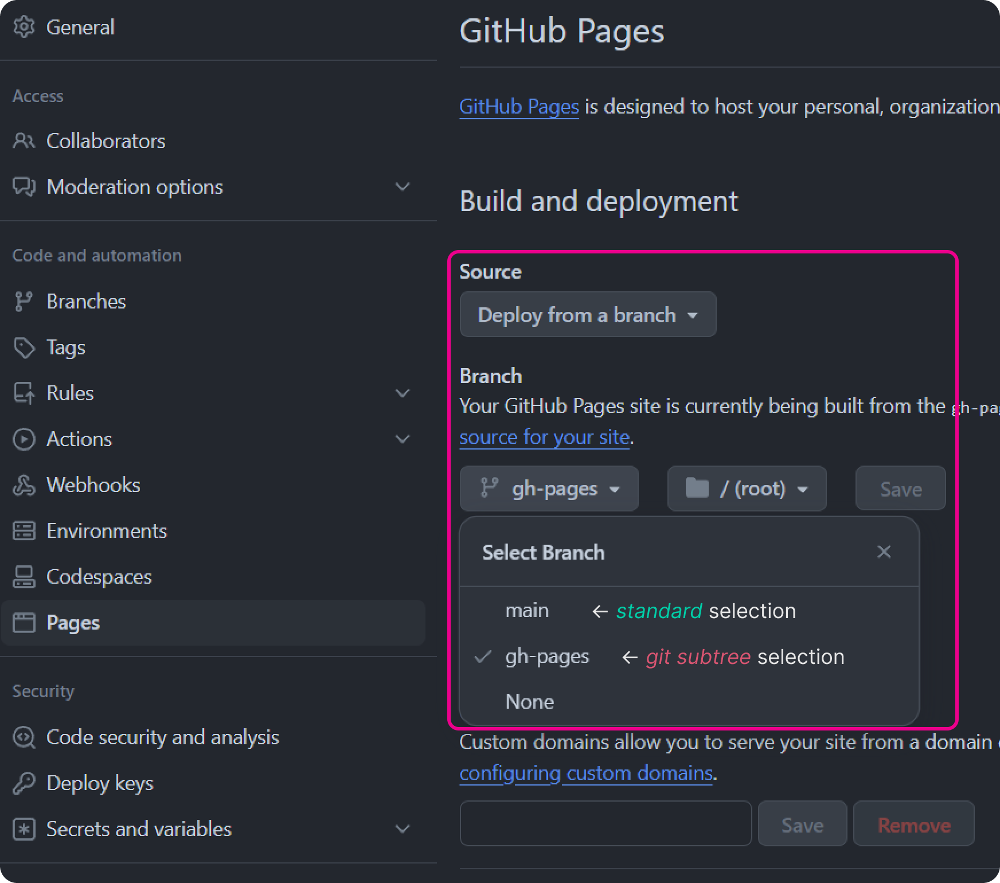

<div align="center">
  

Welcome to my portfolio template!
=================================
  <p>
        
  </p>
</div>


<p>
  
</p>

**This is my personal portfolio in which I have made into an easy to personalize vue template for the public to use free of charge. It comes with a clean and modern design, consistent layout and styles, and instructions that are easy to navigate and understand. Even if you are new to web development, I designed this template to be user-friendly and easy to customize, no matter what stage you are at in your career.**

**So, let's break down the features of this portfolio template and how you can personalize it to fit your own personal brand.**
##### 📝 ***NOTE:*** *I will be adding more features and functionality to make this even more user-friendly and customizable for others to use, so keep checking back for updates!*


<div align="center">
  <a href="https://github.com/appsmithorg/appsmith/releases">
    
  </a>
  <a href="https://www.linkedin.com/in/anthonyvancattenburch/">
    
  </a>
  <a href="https://ajvancattenburch.github.io/">
    
  </a>
  <a href="https://github.com/AJVancattenburch/my_portfolio/forks/">
    
  </a>
</div>

<p align="center">
  
</p>


## 📖 Table of Contents
- [✨ Features](#-features-)
- [📦 Prerequisites](#-prerequisites-)
- [👨‍💻 Getting Started](#-getting-started-)
  + [📜 Create Your Repository Template](#-create-your-repository-template)
  + [♻️ Cloning the Repository](#%EF%B8%8F-cloning-the-repository)
- [📄 Documentation](#-documentation-)
  + [🔍 Project Layout and Content](#-project-layout-and-content)
    * [🧱 Data Structure](#-data-structure)
    * [📂 File Structure](#-file-structure)
  + [📝 Personalizing your Custom Content](#-personalizing-your-custom-content-)
    * [🧙‍♂️ How to Render your Personalized Content](#%EF%B8%8F-how-to-render-your-personalized-content)
    * [🎨 How to Render your Personalized Styles](#-how-to-render-your-personalized-styles)
    * [👨‍💼 How to Display your Resume as a PDF](#-how-to-display-your-resume-as-a-pdf)
- [🚀 Launching your portfolio using Github Pages](#-launching-your-portfolio-using-github-pages-)
- [🤝 Contributions](#-contributions-)
- [🎫 License](#-license)
- [📜 Legal Overview](#-legal-overview)
- [🔏 Copyright](#-copyright)

<p align="center">
  
</p>

## ✨ Features [🔝](#-table-of-contents)
- Clean and modern design
- Consistent layout and styles
- Easy to navigate and understand
- User-friendly and easy to customize
- Instructions for personalizing content
- Instructions for personalizing styles / themes

<p>
  
</p>

## 📦 Prerequisites [🔝](#-table-of-contents)

```diff
- Required Prerequisites:
```
- **Node.js:** You need to have Node installed on your machine to run this project. If you do not have Node installed, you can download it from their website by clicking the link below:

  [](https://nodejs.org/en/download/)

- **LinkedIn Account:** The resume that gets rendered to your portfolio will be a reflection on the resume you have uploaded to your LinkedIn profile page.

  >🛑 In order to render your most current resume per the instructions of this template, **it needs to be attached in *`PDF Format`* within the *`Featured section`* of your LinkedIn Profile!** This is extremely important!

```diff
! Optional Prerequisites:
```

- **subtree:** If you don't have already `git subtree`, it allows you to share commits and content between repositories rather than pointers to install other repositories.

  This can be a very useful tool if you want create a separate branch within your `github.io` repository from your portfolio template repository. Follow the instructions in the link below if you would like to obtain `git subtree`.
  
  [](https://codeengineered.com/blog/how-to-install-git-subtree/)
  
<p>
  
</p>


## 👨‍💻 Getting Started [🔝](#-table-of-contents)
To get started with this portfolio template, you will can choose to either;
  - [♻️ Cloning the Repository](#-cloning-the-repository) directly to your local machine, or
  - [ Forking the Repository](#-forking-the-repository) to your Github account and then cloning it to your local machine (allows you to make local changes and push them to your forked repository).

🤝 Contributions are welcome! If you would like to contribute to this project, you can fork the repository and `make a pull request` with your changes. We will review your changes and merge them into the main branch if they are approved.

### 📜 Create Your Repository Template

1. Click on the `Use this template ▾` dropdown located at the top right of the repository and select `Create a new repository`:

    <p>
      
    </p>

2. Give your template repository a name and description, and click the `Create repository` button:

    <p>
      
    </p>

3. Once you have created your repository, you can clone it to your local machine by following the instructions in the [♻️ Cloning the Repository](#%EF%B8%8F-cloning-the-repository) section below.


### ♻️ Cloning the Repository

1. Click on the green `< > Code ▾` button located at the top right of the repository:

    <p>
      
    </p>

2. `Copy` the HTTPS URL:

    <p>
      
    </p>

3. Open your terminal and navigate to the directory where you want to clone the repository:
    ```bash
    cd your-directory
    ```

4. Clone the repository by typing `git clone` immediately followed by `pasting` the HTTPS URL you copied in step 2:
    ```bash
    git clone https://github.com/AJVancattenburch/my_portfolio.git
    ```

5. Change directories from the root folder to the `my_portfolio` folder by running the following command in your terminal:
    ```bash
    cd my_portfolio
    ```

6. Install the necessary dependencies by running the following command in your terminal now that you are in the `my_portfolio` folder:
    ```bash
    npm i
    ```
    
    ###### **📝 NOTE:** `npm i` is simply shorthand for `npm install` -- you can run *either* command to install the necessary dependencies.

7. Remember to spin up your client by navigating to the `Run and Debug` tab ( or press Ctrl+Shift+D ) in vsCode and clicking the Start Client button on the `▶️ Run and Debug` Dropdown:
    
    <p>
      
    </p>

    --OR--

    Run the following command in your terminal:</li></p>
    ```bash
    npm run serve
    ```

    ###### **📝 NOTE:** `npm run serve` will start the development server on `http://localhost:8080/` by default. You can change the port number by modifying the `PORT` variable in the `env.js` file located in the root directory of the project.

8. Open your browser and navigate to `http://localhost:8080/` to view the portfolio template on your local machine.

9. **You are now ready to start customizing your portfolio!** 🎉

    > *See the following [🧱 Data Structure](#-data-structure) section to get an idea of where your data is coming from and how you can change it by examining how it gets rendered to your vue components.*

<p>
  
</p>

## 📄 Documentation [🔝](#-table-of-contents)

This section will provide a brief overview of the project layout and content, including the data structure and file structure of the portfolio template that you will be working with to customize your portfolio.


### 🔍 Project Layout and Content

<p>
  
</p>

#### 🧱 Data Structure

The main data structure you will be working with is located in the `/src/constants` folder located here:

<p>
  
</p>

I have provided a brief visual reference for how the static data properties (seperated by color) that is rendered from the `/src/constants` folder to the components in the `/src/components` folder. Consider this example from the `Feedbacks.js` file located in the constants folder to the `Feedback.vue` component located in the components folder:
      

Each file in the `/src/constants` folder holds the static data for each section, brought into your components as a javascript object. This data is then iterated over with a `v-for` loop to render the content on the page.

<p>
  
</p>

#### 📂 File Structure

The file structure of this project is broken down into the following folders:

- **`/src/assets`** - Contains all images, icons, and SVG files used in the project.
- **`/src/components`** - Contains all the Vue components that make up the portfolio page.
- **`/src/constants`** - Contains all the static data for each section of the portfolio page.
- **`/src/pages/HomePage.vie`** - Contains the main view file that renders the portfolio page.
- **`/src/App.vue`** - Contains the main Vue file that renders the entire application.
- **`/src/main.js`** - Contains the main JavaScript file that initializes the Vue application.

Your folder/file structure should look like this if you have cloned the repository correctly. I will also notate the most important folders and files that you will be working with to customize your portfolio template:

```bash
  my_portfolio
  ├── src
  │   ├── assets ← 🖼️🎨 f
  │   │   ├── img ← 🖼️ Contains all images used in the project, broken down by type.
  │   │   │   ├── ...📂 folders for different image types (e.g. icons, logos, project images, etc.)
  │   │   └── scss 
  │   │       ├── ...other scss files
  │   │       ├── _styles.scss ← 🎨 Contains all main styles, and where you can change the color scheme of the entire portfolio.
  │   ├── components ← 🧩 Contains all Vue components or 'sections' that make up the portfolio page.
  │   │   ├── about
  │   │   │   ├── About.vue ← 📄 Each section has a 'container to style'...
  │   │   │   └── AboutCard.vue ← 📄 ...and a 'card to render the content' for each section.
  │   │   ├── contact
  │   │   │   ├── Contact.vue
  │   │   │   └── ContactCard.vue
  │   │   ├── education
  │   │   │   ├── Education.vue
  │   │   │   └── EducationCard.vue
  │   │   ├── experience
  │   │   │   ├── Experience.vue
  │   │   │   └── ExperienceCard.vue
  │   │   ├── feedback
  │   │   │   ├── Feedback.vue
  │   │   │   └── FeedbackCard.vue
  │   │   ├── projects
  │   │   │   ├── Project.vue
  │   │   │   └── ProjectCard.vue
  │   │   ├── resumeModal
  │   │   │   ├── ResumeCard.vue
  │   │   │   └── ResumeModal.vue
  │   │   ├── scalableVectorGraphics
  │   │   │   ├── SVGGitHub.vue
  │   │   │   ├── SVGHeroBackground.vue
  │   │   │   └── SVGLinkedIn.vue
  │   │   └── technologies
  │   │       ├── Technologies.vue
  │   │       └── TechnologyCard.vue
  │   ├── constants ← 📂 Contains all the static data for each section of the portfolio page.
  │   │   ├── _index.js ← 🔀 Exports all the static data from each file in the constants folder.
  │   │   ├── About.js ← 📝 Each sections editable static data is customized in each sections javascript file
  │   │   ├── Contact.js
  │   │   ├── Education.js
  │   │   ├── Experience.js
  │   │   ├── Feedbacks.js
  │   │   ├── Projects.js
  │   │   └── Technologies.js
  │   ├── pages
  │   │   └── HomePage.vue
  ├── App.vue
  ├── main.js
  └── env.js ← 📄 Contains the PORT variable to change the 'port number' of the development server, along with your 'emailjs template and user information'
```

<p>
  
</p>

### 📝 Personalizing your Custom Content [🔝](#-table-of-contents)

#### 🧙‍♂️ How to Render your Personalized Content

By simply changing the values in the above referenced files located in the `/src/constants` folder, you can easily customize this portfolio to fit your own personal brand.


Each file in the `/src/constants` folder represents a different section of the portfolio page. 

#### 🎨 How to Render your Personalized Styles

The `_root.scss` file in the `/src/assets/scss` folder that allows you to easily change the color scheme of the entire portfolio with just a few lines of code. Visual reference of file location for themes and styles provided below:

<p>
  
</p>

Read the relevant comments to see what each CSS variable will style on the page. I will be adding these necessary comments above specific variable names so that you can change the page background, font color, and gradient color themes on the fly!


#### 👨‍💼 How to Display your Resume as a PDF

This method of displaying your resume as a PDF is a great way to easily create a printable version of your resume that can be downloaded by those viewing your portfolio.

  ##### *If you already have your resume uploaded to your `Featured` section on LinkedIn and in `PDF Format`, you can skip this step and continue on to step 2.*

1. **Upload your resume to your LinkedIn profile:**

    - Assuming you either have your resume in PDF or docx format (if not, ***`ATS scanners prefer docx or PDF format`***) you can easily convert it with Microsoft Word, Google Docs, or any other word processing software by simply saving it as a PDF file from the `File` dropdown menu.

    - Navigate to your LinkedIn profile and scroll to the `Featured` section of your profile.

    - Click on the `+` dropdown button and select the `🖼️ Add media` option from the dropdown menu.

    - Upload your resume *in your saved PDF format* to your LinkedIn profile.

2. **Update the `<iframe src="">` and `<object data="">` element attribute string values in the `ResumeCard.vue` component:**

    - Go to your LinkedIn profile page and scroll to the `Featured` section of your profile.

    - Click on the image of your resume to open the LinkedIn resume modal from your profile.

    - Once open, press `Ctrl + Shift + I` to open the developer tools in your browser, then open the `Network` tab.

    - You should see a request for a PDF file in the `Network` tab. That will typically be a string of numbers and letters followed by `?e=`. Reference the image below for an example of what you should be looking for, highlighted by the pink containers:

      <p>
        
      </p>

    - The property we are looking for with the values you want to `copy` is the `transcribedDocumentUrl` property. Right click the string value and select `Copy string contents` option.

    - Replace the `<iframe src="">` and `<object data="">` element attribute string values in the `ResumeCard.vue` component with the copied string value from the `transcribedDocumentUrl` property in the `Network` tab where you see the `highlighted code below from your ResumeCard.vue component`:

      <p>
        
      </p>

      ###### **📝 NOTE:** *If you would like to display your resume from a different source, you can do so by changing the `<iframe src="">` and `<object data="">` element attribute string values to whatever you like.*

      - If you noticed by looking at the image above that we did not remove `#thumbnails=0&zoom=100,left,top&view=fit` from the end of the string, this is because it is necessary to keep the string in order to display the PDF in the correct format. If you remove this string, the layout of the PDF will be distorted and not display correctly. 

        >##### If you would like to learn more about how you can customize the PDF viewer, I have provided a link to a cheat sheet below from Adobe that will help you understand how to modify *`PDF Open Parameters`* to customize the viewer to your liking:
        >[](https://pdfobject.com/pdf/pdf_open_parameters_acro8.pdf)

    - If you still aren't seeing your resume displayed in the `ResumeCard.vue` component, simply refreshing the page should do the trick!

    - **Great job!** You have now successfully displayed your resume as a PDF in your portfolio and can continue on to launching it live through GitHub pages! 🎉

<p>
  
</p>

## 🚀 Launching your portfolio using Github Pages [🔝](#-table-of-contents)

The following instructions will show you how to `deploy your portfolio by removing your repository name from the URL` in an easy step-by-step guide.

This is preferred for portfolio pages because it will make your portfolio URL look cleaner and more professional.


To launch your portfolio using Github Pages, simply follow the instructions below:


### 📝 Instructions:

1. **Create a new repository on Github:**

    - Create a `new repository` for your portfolio. You can do this by clicking on the `New` button located on the top right of your repository page (or any of the other methods you prefer to create a new repository on Github).

    - Name your repository `your-github-username.github.io` with that ***exact*** format! This is important because Github Pages will automatically deploy your portfolio to the web using *this* naming convention as your URL. Refer to the image below for an example of how to name your repository that will be your portfolio URL:

      <p>
        
      </p>

    - Click the `Create repository` button to create your new repository.

2. **Push your portfolio to your new repository:**

    - Once you have created your new repository, you will need to push your portfolio to your

    - First, you will need to build your portfolio by running the following command in your terminal:
        ```bash
        npm run build
        ```
    - Next, you will need to add docs using git add and commit your changes using git commit:
        ```bash
        git add .
        git commit -m "added docs"
        ```
    - ⚠️ **Important:** If you intend to use the method that uses `git subtree` to deploy your portfolio, you will need to push your changes to your repository using the following command:
        ```bash
        git subtree push --prefix docs origin gh-pages
        ```
    - Otherwise, you can push your changes to your repository using the following command:
        ```bash
        git push origin main
        ```
    - Once you have pushed your changes to your repository, you can navigate to your repository on Github to see your changes.
    
3. **Deploy your portfolio to Github Pages:**

    - Navigate to the `Settings` tab of your repository on Github.

    - Scroll down to the `Pages` section of the settings page.

      <p>
        
      </p>

    - Under the `Source` dropdown menu, select the `main` branch (or `gh-pages` branch if you are using the `subtree` method).

      <p>
        
      </p>

    - Click the `Save` button to save your changes.

    - Once you have saved your changes, you will see a message that says `Your site is ready to be published at https://your-github-username.github.io/your-repository-name/`.

    - It may take a few minutes for your portfolio to be deployed to Github Pages, so be patient if you do not see your portfolio immediately, but you should see your portfolio live on the web shortly.

    - **Congratulations!** You have successfully deployed your portfolio to Github Pages! 🎉

    **Still having trouble deploying your portfolio?** That's okay! Are you more of a visual learner? There is a great 7 minute video tutorial here that also explains how to deploy your portfolio to Github Pages just like the instructions above, along with another 3 minute video if you're interested in integrating `git subtree` like we did in the instructions above. Check them both out here:
    
    🎥 [YouTube Video Tutorial](https://www.youtube.com/watch?v=OltY8JIaP-4&t=231s)

    <a href="https://youtu.be/yo2bMGnIKE8?si=SYJGB59MaAVgxQLM">
      &nbsp;
      &nbsp;Using git subtree Video Tutorial
    </a>
    
    **Or, if you prefer to read the official documentation**, you can find it here:

    📖 [Github Pages Official Documentation](https://docs.github.com/en/pages/getting-started-with-github-pages/creating-a-github-pages-site)


<p>
  
</p>


<p>
  
</p>


## 🤝 Contributions [🔝](#-table-of-contents)

Contributions are welcome! If you would like to contribute to this project, you can `fork the repository and make a pull request` with your changes. We will review your changes and merge them into the main branch if they are approved.

## 🎫 License

### Base Template: CodeWorks Vue Starter

This template is designed to help get students started building vue applications


## 📜 Legal Overview

The content under the CodeWorks®, LLC Organization and all of the individual repos are solely intended for use by CodeWorks Instruction to deliver Educational content to CodeWorks Students.


## 🔏 Copyright

© CodeWorks® LLC, 2021. Unauthorized use and/or duplication of this material without express and written permission from CodeWorks, LLC is strictly prohibited.


&nbsp;&nbsp;&nbsp;&nbsp;&nbsp;&nbsp;