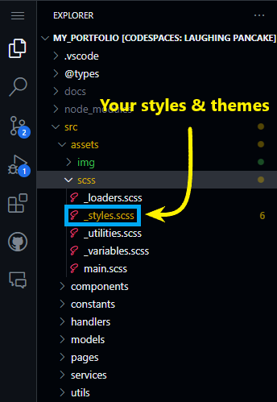

<div align="center">
  

Welcome to my portfolio template!
=====================

</div>

<p>
  
</p>

**This is my personal portfolio in which I have made into an easy to personalize vue template for the public to use free of charge. It comes with a clean and modern design, consistent layout and styles, and instructions that are easy to navigate and understand. Even if you are new to web development, I designed this template to be user-friendly and easy to customize, no matter what stage you are at in your career.**

**So, let's break down the features of this portfolio template and how you can personalize it to fit your own personal brand.**
##### 📝 ***NOTE:*** *I will be adding more features and functionality to make this even more user-friendly and customizable for others to use, so keep checking back for updates!*

<p align="center">
  
</p>

<div align="center">
  <a href="https://github.com/appsmithorg/appsmith/releases">
    
  </a>
  <a href="https://www.linkedin.com/in/anthonyvancattenburch/">
    
  </a>
  <a href="https://ajvancattenburch.github.io/">
    
  </a>
  <a href="https://github.com/AJVancattenburch/my_portfolio/forks/">
    
  </a>
</div>

## 📖 Table of Contents
- [🚀 Features](#-features-)
- [📦 Prerequisites](#-prerequisites-)
- [👨‍💻 Getting Started](#-getting-started-)
- [📄 Documentation](#-documentation-)
  - [Project Layout and Content](#project-layout-and-content)
    - [Data Structure](#data-structure)
    - [File Structure](#file-structure)
  - [🧙‍♂️ How to Render your Personalized Content](#%EF%B8%8F-how-to-render-your-personalized-content-)
  - [🎨 How to Render your Personalized Styles](#-how-to-render-your-personalized-styles-)
- [🎫 License](#-license-)
- [📜 Legal Overview](#-legal-overview-)
- [©️ Copyright](#-copyright-)


## 🚀 Features [🔝](#-table-of-contents)
  - Clean and modern design
  - Consistent layout and styles
  - Easy to navigate and understand
  - User-friendly and easy to customize
  - Instructions for personalizing content
  - Instructions for personalizing styles / themes

## 📦 Prerequisites [🔝](#-table-of-contents)
- **Node.js:** You need to have Node installed on your machine to run this project. If you do not have Node installed, you can download it from their website by clicking the link below:

  <p>
    <a href="https://nodejs.org/en/download/">
      
    </a>
  </p>


## 👨‍💻 Getting Started [🔝](#-table-of-contents)
To get started with this portfolio template, you will need to clone this repository to your local machine. You can do this by following the instructions below:

1. Click on the green "Code" button located at the top right of the repository:
    <p>
      
    </p>

2. `Copy` the HTTPS URL:

    <p>
      
    </p>

3. Open your terminal and navigate to the directory where you want to clone the repository:
    ```bash
    cd your-directory
    ```

4. Clone the repository by typing `git clone` immediately followed by `pasting` the HTTPS URL you copied in step 2:
    ```bash
    git clone https://github.com/AJVancattenburch/my_portfolio.git
    ```

5. Change directories from the root folder to the `my_portfolio` folder by running the following command in your terminal:
    ```bash
    cd my_portfolio
    ```

6. Install the necessary dependencies by running the following command in your terminal now that you are in the `my_portfolio` folder:
    ```bash
    npm i
    ```
    - ###### **📝 NOTE:** `npm i` is simply shorthand for `npm install` -- you can run *either* command to install the necessary dependencies.

7. Remember to spin up your client by navigating to the `Run and Debug` tab ( or press Ctrl+Shift+D ) in vsCode and clicking the Start Client button on the `▶️ Run and Debug` Dropdown:
    
    <p>
      
    </p>

    --OR--

  - Run the following command in your terminal:</li></p>
    ```bash
    npm run serve
    ```
    - ###### **📝 NOTE:** `npm run serve` will start the development server on `http://localhost:8080/` by default. You can change the port number by modifying the `PORT` variable in the `.env` file located in the root directory of the project.

8. Open your browser and navigate to `http://localhost:8080/` to view the portfolio template on your local machine.

9. **You are now ready to start customizing your portfolio! See the following [🧱 Data Structure](#-data-structure-) section to get an idea of where your data is coming from and how you can change it by examinging how it gets rendered to your vue components.

<p align="top">
  
</p>

## 📄 Documentation [🔝](#-table-of-contents)

 - ### Project Layout and Content

    - #### Data Structure

      The main data structure you will be working with is located in the `/src/constants` folder located here:

      <p>
        
      </p>

      I have provided a brief visual reference for how the static data properties (seperated by color) is rendered from the `/src/constants` folder to the components in the `/src/components` folder. Consider this example from the `Feedbacks.js` file located in the constants folder to the `Feedback.vue` component located in the components folder:
      

      Each file in the `/src/constants` folder holds the static data for each section, brought into your components as a javascript object. This data is then iterated over with a `v-for` loop to render the content on the page.

    - #### File Structure

      The file structure of this project is broken down into the following folders:

      - **`/src/assets`** - Contains all images, icons, and SVG files used in the project.
      - **`/src/components`** - Contains all the Vue components that make up the portfolio page.
      - **`/src/constants`** - Contains all the static data for each section of the portfolio page.
      - **`/src/pages/HomePage.vie`** - Contains the main view file that renders the portfolio page.
      - **`/src/App.vue`** - Contains the main Vue file that renders the entire application.
      - **`/src/main.js`** - Contains the main JavaScript file that initializes the Vue application.

      Your folder/file structure should look like this if you have cloned the repository correctly. I will also notate the most important folders and files that you will be working with to customize your portfolio template:

      ```bash
        my_portfolio
        ├── src
        │   ├── assets ← 🖼️🎨 f
        │   │   ├── img ← 🖼️ Contains all images used in the project, broken down by type.
        │   │   │   ├── ...📂 folders for different image types (e.g. icons, logos, project images, etc.)
        │   │   └── scss 
        │   │       ├── ...other scss files
        │   │       ├── _root.scss ← 🎨 Contains all main styles, and where you can change the color scheme of the entire portfolio.
        │   ├── components ← 🧩 Contains all Vue components or 'sections' that make up the portfolio page.
        │   │   ├── about
        │   │   │   ├── About.vue ← 📄 Each section has a 'container to style'...
        │   │   │   └── AboutCard.vue ← 📄 ...and a 'card to render the content' for each section.
        │   │   ├── contact
        │   │   │   ├── Contact.vue
        │   │   │   └── ContactCard.vue
        │   │   ├── education
        │   │   │   ├── Education.vue
        │   │   │   └── EducationCard.vue
        │   │   ├── experience
        │   │   │   ├── Experience.vue
        │   │   │   └── ExperienceCard.vue
        │   │   ├── feedback
        │   │   │   ├── Feedback.vue
        │   │   │   └── FeedbackCard.vue
        │   │   ├── projects
        │   │   │   ├── Project.vue
        │   │   │   └── ProjectCard.vue
        │   │   ├── resumeModal
        │   │   │   ├── ResumeCard.vue
        │   │   │   └── ResumeModal.vue
        │   │   ├── scalableVectorGraphics
        │   │   │   ├── SVGGitHub.vue
        │   │   │   ├── SVGHeroBackground.vue
        │   │   │   └── SVGLinkedIn.vue
        │   │   └── technologies
        │   │       ├── Technologies.vue
        │   │       └── TechnologyCard.vue
        │   ├── constants ← 📂 Contains all the static data for each section of the portfolio page.
        │   │   ├── _index.js ← 🔀 Exports all the static data from each file in the constants folder.
        │   │   ├── About.js ← 📝 Each sections editable static data is customized in each sections javascript file
        │   │   ├── Contact.js
        │   │   ├── Education.js
        │   │   ├── Experience.js
        │   │   ├── Feedbacks.js
        │   │   ├── Projects.js
        │   │   └── Technologies.js
        │   ├── pages
        │   │   └── HomePage.vue
        ├── App.vue
        ├── main.js
        └── env.js ← 📄 Contains the PORT variable to change the 'port number' of the development server, along with your 'emailjs template and user information'
      ```


    - #### 🧙‍♂️ How to Render your Personalized Content [🔝](#-table-of-contents)

      By simply changing the values in the above referenced files located in the `/src/constants` folder, you can easily customize this portfolio to fit your own personal brand.

      

      Each file in the `/src/constants` folder represents a different section of the portfolio page. 

    - #### 🎨 How to Render your Personalized Styles [🔝](#-table-of-contents)

      The `_root.scss` file in the `/src/assets/scss` folder that allows you to easily change the color scheme of the entire portfolio with just a few lines of code. Visual reference of file location for themes and styles provided below:

      <p>
        
      </p>

      Read the relevant comments to see what each CSS variable will style on the page. I will be adding these necessary comments above specific variable names so that you can change the page background, font color, and gradient color themes on the fly!

      As this project nears completion, I will be adding more detailed instructions on how to use this template for your own portfolio, so stay tuned for more updates!


  <p align="top">
    
  </p>

## 🎫 License [🔝](#-table-of-contents)

### Base Template: CodeWorks Vue Starter

This template is designed to help get students started building vue applications

## 📜 Legal Overview

The content under the CodeWorks®, LLC Organization and all of the individual repos are solely intended for use by CodeWorks Instruction to deliver Educational content to CodeWorks Students.

---

## ©️ Copyright

© CodeWorks® LLC, 2021. Unauthorized use and/or duplication of this material without express and written permission from CodeWorks, LLC is strictly prohibited.


